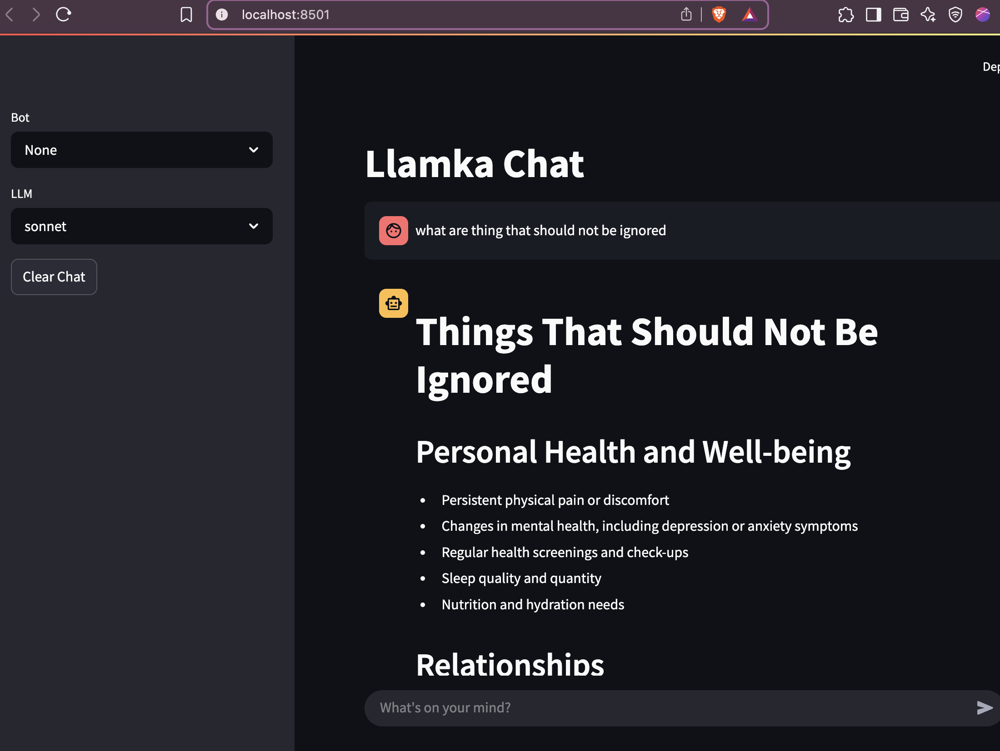

# botglue
 

MLOps for building second brain

There is few principles we want to build botglue around

| Principle | Because |
| :-- | :-- |
| Standardize interface for different model vendors | Ability to substitute and store conversations uniformly |
| Automation of pipelines | Consistency  |
| Maintain teargeted conversation datasets | Capture requirements and provide data for finetuining and evaluation |
| Model evaluation and management | Informed decision making about trade off between open and closed models |
| Preference to open weight models and self hosting | Ability to finetune, privacy and lower cost |

## Architecture

* llore - (botglue-core) Tornado App that keep everything running. llore provides api and all other services built on top of it
    * MVP
        - [x] provide abstraction interface over LLM providers (local: ollama;  remote: openai,  claude;)
        - [x] maintain external document locations/versions and rebuild vector db collections on changes
        - [ ] augmentation pipelines and chatbot config
        - [x] completion api to interact with configured models and chatbots
    * later
        - [ ] store chatbot interactions in oumi conversation format per user if instructed
        - [ ] maintain chatbot library (includes: system prompt, finetuning and augmentation pipelines, data dependencies, and build schedule)
        - [ ] maintain conversation datasets and use them for tuning, RAG and testing
        - [ ] schedule and run pipelines: finetuning, RAG, chatbot evaluation 
        - [ ] monitor and run services: databases, queues, proxies, ui (llit)

* llit - streamlit UI 
    * MVP
        - [x] Chatbot interaction 
    * later
        - [ ] Inspect previous conversations or from library
        - [ ] Inspect data: sql, document db, vector db
        - [ ] Inspect logs from pipelines
        - [ ] Configuration: models, chatbot, pipelines

Got API and streamlit endpoints working, almost MVP!!!

* * *

## Project Docs

For how to install uv and Python, see [installation.md](installation.md).

For development workflows, see [development.md](development.md).

For instructions on publishing to PyPI, see [publishing.md](publishing.md).

* * *

*This project was built from
[simple-modern-uv](https://github.com/jlevy/simple-modern-uv).*
